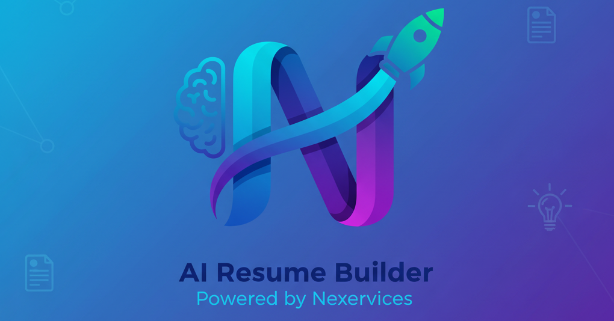

# AI-Resume-Builder


A powerful, local-first desktop application designed to streamline the resume creation process. This tool separates your professional data from its visual presentation, allowing for instant template switching, AI-powered content suggestions, and real-time PDF previews, all while ensuring your data remains private on your local machine.

Built with Python, PyQt6, and a LaTeX backend for pixel-perfect, professional-grade resumes.



## Key Features

-   **Live PDF Preview:** See your resume update in real-time as you type, thanks to an efficient debouncing mechanism.
-   **Dynamic Section Management:** Add custom sections, delete unwanted ones, and reorder them with simple up/down buttons. The final PDF perfectly reflects your chosen layout.
-   **Multiple Professional Templates:** Instantly switch between different LaTeX resume templates (`moderncv`, `classiccv`, and more) with a single click.
-   **Targeted AI Content Suggestions:** Get AI-powered suggestions for specific fields (like your summary or a single job description) without overwriting your other work.
-   **Intelligent ATS Checker:** Paste a job description to get an AI-driven ATS (Applicant Tracking System) score out of 100, complete with actionable feedback on strengths, weaknesses, and missing keywords.
-   **Automatic Dependency Management:** The application automatically checks for and installs required Python libraries on first run. It also intelligently detects if LaTeX is missing and provides OS-specific installation instructions.
-   **100% Local and Private:** Your resume data and API keys are never stored or sent anywhere except directly to the AI provider you choose. No login or cloud account is required.

---

## Project Structure

The project is organized into a modular structure to separate concerns, making it easy to maintain and extend.

```
/AI-Resume-Builder/
|
|-- requirements.txt             # Lists all Python library dependencies.
|-- main.py                      # The main entry point for the application.
|-- dependency_checker.py        # Checks for Python libs & LaTeX before the app starts.
|-- logger_setup.py              # Configures application-wide logging.
|-- latex_service.py             # Handles Jinja2 templating and LaTeX-to-PDF compilation.
|-- openrouter_service.py        # Manages all API calls to the AI model provider.
|
|-- main_window.py               # The core QMainWindow class that holds the application.
|-- ui_layout.py                 # Constructs the visual layout and adds widgets to the window.
|-- ui_components.py             # Defines reusable custom UI widgets (e.g., SectionWidget).
|-- event_handlers.py            # Contains all functions that respond to user actions.
|-- data_handler.py              # Responsible for gathering and structuring data from the UI.
|
|-- /templates/                  # Contains all the LaTeX resume templates.
|   |-- /moderncv/
|   |-- /classiccv/
|   |-- /moderncv_1/
|
|-- /output/                     # (Auto-created) Stores all generated PDF resumes.
|-- app.log                      # (Auto-created) The application log file.
```

---

## Script & Component Breakdown

This section explains the role of each key script in the application.

| File / Module         | Role & Responsibilities                                                                                             |
| --------------------- | ------------------------------------------------------------------------------------------------------------------- |
| `main.py`             | **Application Entry Point.** Its only job is to run the `dependency_checker` and, if successful, launch the app. |
| `dependency_checker.py`| **Pre-flight Checks.** Installs Python packages via `pip`. Checks for a system-level LaTeX installation and provides interactive prompts if it's missing. |
| `main_window.py`        | **The Main Shell.** This script defines the `QMainWindow` itself. It initializes all the other modules (`UILayout`, `EventHandlers`) and connects them together. |
| `ui_layout.py`          | **The Architect.** This script is responsible for building the entire visual layout of the application—creating widgets, placing them in layouts, and connecting their signals (like `clicked`) to the appropriate function in `event_handlers.py`. |
| `event_handlers.py`     | **The Brains.** Contains all the logic that runs in response to user interaction (e.g., `handle_ats_check`, `save_final_pdf`, `move_section`). It's the "controller" in a Model-View-Controller pattern. |
| `data_handler.py`       | **The Scribe.** Has one critical job: to read all the data from the various input fields in their current visual order and assemble it into a structured Python dictionary that the backend services can use. |
| `ui_components.py`      | **The Building Blocks.** Defines custom, reusable Qt widgets. For example, `SectionWidget` (a `QGroupBox` with up/down/delete buttons) is defined here so it can be used multiple times. |
| `latex_service.py`      | **The Publisher.** Takes the data dictionary from `data_handler.py`, uses the Jinja2 templating engine to inject it into a `.tex` template, and then calls the system's `pdflatex` command to compile the final PDF. |
| `openrouter_service.py` | **The AI Communicator.** Constructs the detailed prompts for the AI and handles all API requests to OpenRouter for both targeted content suggestions and the ATS analysis. |
| `logger_setup.py`       | **The Stenographer.** Sets up the application-wide logging system to output messages to the console, a file (`app.log`), and the "Application Logs" tab in the GUI. |

---

## Tunable Parameters

This application has been designed to be easily configurable. Here are some key parameters you can tune in the code to change the application's behavior.

| File                  | Parameter                                            | Default Value                    | Description                                                                                                                   |
| --------------------- | ---------------------------------------------------- | -------------------------------- | ----------------------------------------------------------------------------------------------------------------------------- |
| `main_window.py`        | `self.preview_timer.setInterval(...)`                | `1500` (milliseconds)            | The "debounce" delay for the live preview. Increase for less frequent updates on slow machines; decrease for faster updates. |
| `openrouter_service.py` | `json={"model": ...}`                                | `"mistralai/mistral-7b-instruct"`| **The AI Model.** You can change this to any compatible model string from OpenRouter.ai (e.g., a GPT or Llama model). |
| `ui_layout.py`          | `self.win.template_combo.addItems([...])`            | `["moderncv", ...]`              | **Template List.** To add a new template, place its folder in `/templates` and add the folder name to this list.          |
| `dependency_checker.py` | `url = "https://miktex.org/download"`                | URL string                       | The download URL shown in the pop-up if LaTeX is missing. Can be changed if the official link changes.                  |
| `latex_service.py`      | `base_filename = "_preview"`                         | `"_preview"`                       | The filename for the temporary PDF used by the live preview. You can change this if needed.                                   |

---

## Installation & Setup

### Prerequisites

You must have the following software installed on your system **before** running the application.

1.  **Python:** Version 3.8 or newer.
2.  **A LaTeX Distribution:** This is essential for PDF generation.
    -   **Windows:** [**MiKTeX**](https://miktex.org/download). During installation, choose the option to **"install missing packages on-the-fly."**
    -   **Linux (Debian/Ubuntu):** **TeX Live**. See the command below.
    -   **macOS:** [**MacTeX**](https://www.tug.org/mactex/downloading.html).

### Installation Steps

#### For Linux (Debian/Ubuntu)

1.  **Open a terminal** (`Ctrl+Alt+T`).
2.  **Install core system dependencies:**
    ```bash
    sudo apt update && sudo apt upgrade -y
    sudo apt install python3 python3-pip python3-venv texlive-full -y
    ```
3.  **Navigate to the project directory** and run the application.

#### For Windows & macOS

1.  **Install Python** from the official website if you haven't already.
2.  **Install MiKTeX (Windows) or MacTeX (macOS)** from the links above.
3.  **Open a terminal** (Command Prompt or PowerShell on Windows) and navigate to the project directory.

### How to Run

The application will handle the installation of its required Python libraries automatically.

1.  Navigate to the project's root directory in your terminal.
2.  Run the main script:
    ```bash
    # For Linux/macOS
    python3 main.py

    # For Windows
    python main.py
    ```
    On the first run, you will see `pip` installing packages in the terminal. If LaTeX is not found, a helpful pop-up will guide you. Afterwards, the application window will appear.

